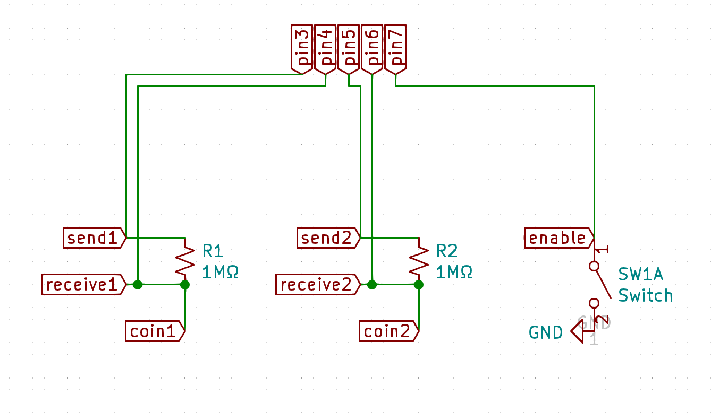

# CapKeys: Capacitive Sense Keys

Flexible arduino project for capacitive sense key mapping over usb.

## Options

* `SENSOR_NUM` sets number of sensors.
* `THR` is the threshold level needed for a keypress.
* `KEYS`  is a key map array for keyboard input.
* `sensors` is an array of capacitive sensor library definitions.
* `values` is an array of values updated every loop.

```Cpp
const uint8_t SENSOR_NUM = 2; // number of sensors
const long THR = 1000; // may or may not need tuning
const char KEYS[ SENSOR_NUM ] = { 'z', 'x' };
CapacitiveSensor sensors[ SENSOR_NUM ] = { CapacitiveSensor( 3, 4 ), CapacitiveSensor( 6, 5 ) };
long values[ SENSOR_NUM ];
```

---

## Enable Pin

Enable Pin allows for an on/off switch. Enabled by default.

Comment `#define ENPIN 7` to disable it in a build. 

```Cpp
#define ENPIN 7 // allows for an on/off switch
```

---

## Debug Mode

Debug mode switches keyboard for serial output over usb.

Uncomment `#define DEBUG_MODE` to enable it in a build. 

```Cpp
#define DEBUG_MODE // switches keyboard for serial output
```

---

## NeoPixel Support

A neopixel on/off indicator is included.
Only available with enable pin.
Uncomment `#define NEOPIXEL` to enable it in a build.

### Options
* `NEOPIXEL_PIN` is the pin used for neo pixel communication.
* `NEOPIXEL_ON` is a neopixel color definition for on state.
* `NEOPIXEL_OFF` is a neopixel color definition for off state.
* `pixel` is the neopixel library class

```Cpp
#define NEOPIXEL
#ifdef NEOPIXEL
#define NEOPIXEL_PIN 40
#define NEOPIXEL_ON Color( 0, 15, 0 )
#define NEOPIXEL_OFF Color( 15, 0, 0 )
#include <Adafruit_NeoPixel.h>
Adafruit_NeoPixel pixel = Adafruit_NeoPixel( 1, NEOPIXEL_PIN, NEO_GRB + NEO_KHZ800 );
#endif
```

---

## Schematics

Suggested circuits for use with CapKeys.

### Single Sensor
Use a 1MΩ resistor between the send and receive pin.


### Default Schematic
Schematic for suggested circuit to use for default code settings. Key outputs default to z on coin1, and x on coin2 which maps well to games (like osu! :3).


